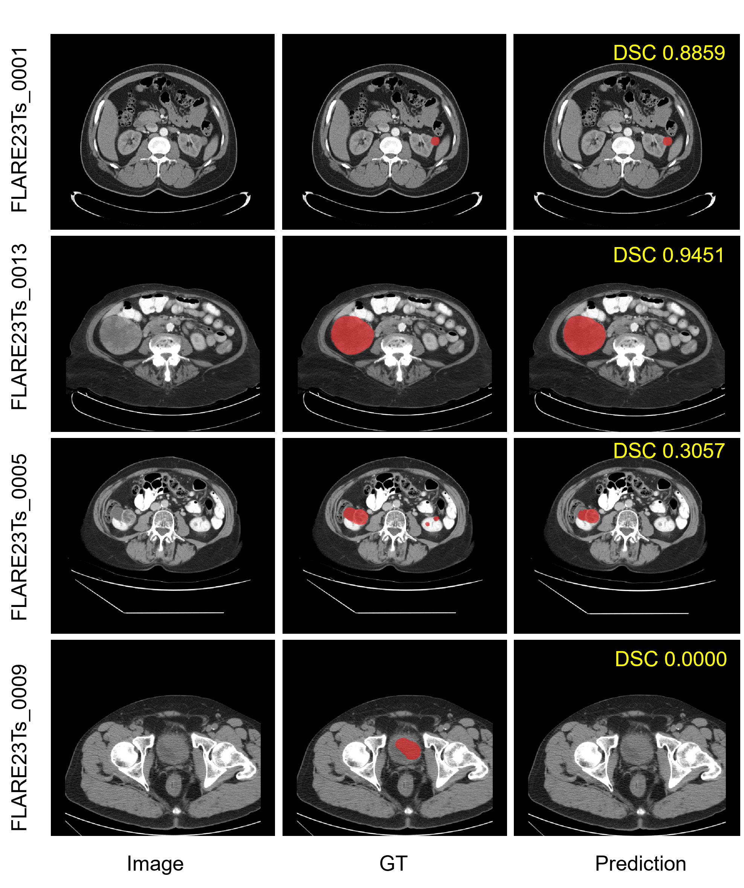

# 🏆 We Won the Champion of MICCAI FLARE2024 Challenge Task1!

## 🔗 Key Links

- **FLARE24 Official Website**: [Task1](https://www.codabench.org/competitions/2319/)

- **Docker Download**: [Baidu NetDisk](https://pan.baidu.com/s/1SbrBYHYYxjQZGpYQRPYAYA?pwd=yrjx) or [Google Drive](https://drive.google.com/file/d/1patISup4J6jAZrrkhugiWNBGNfT0co3C/view?usp=sharing)

  You only need to place all the `.nii.gz` files ready for inference in the `inputs` directory. Then, run the following commands to start inference:
  ```bash
  docker load -i gmai.tar.gz
  docker container run --gpus "device=all" --name gmai --rm \
    -v $PWD/inputs/:/workspace/inputs/ \
    -v $PWD/outputs/:/workspace/outputs/ \
    gmai:latest /bin/bash -c "sh predict.sh"
- **Slides Download**: View our technical presentation and findings [Baidu NetDisk](https://pan.baidu.com/s/1odgg5nFoAqW516QyVb4rRg?pwd=povu) or [Google Drive](https://drive.google.com/file/d/12RL0UXq4FNSGCfv-kVZxgW1EOwsHZUoC/view?usp=drive_link)
- **中文介绍**：[知乎](https://zhuanlan.zhihu.com/p/8374029165) 

# 🔍 A 5.6M Parameter U-Net for Efficient Whole-body Tumor Segmentation

## 🆚 Key Differences Between Our Method and the default nnU-Net

| Configuration | Our Method 🚀 | nnUNetV2 🗿 |
|---------------|--------------|-------------|
| Number of Stages ⬇️ | 4 | 6 |
| Training Epochs ⏱️ | 2000 | 1000 |
| Learning Rate 📊 | 0.001 | 0.01 |
| Target Spacing 📐 | 2, 2, 3 | 0.8, 0.8, 3 |

> 💡 Our method achieves efficient segmentation with fewer stages and lower resample resolution.

## 📂 Key Files in this Repository

Only two files you need to focus on:

1. [nnUNetTrainer_varianst.py](./nnunetv2/training/nnUNetTrainer/nnUNetTrainer_varianst.py)
   - Custom nnUNet trainer with modified training parameters
   
2. [plans.json](./nnUNet_results/Dataset024_FLARE24_Task1/nnUNetTrainer_Epoch2000_Lr1e3__nnUNetPlans__3d_fullres_S4D2W32/plans.json) 
   - Network architecture and configuration settings

## How to Reimplement?

### 🛠️ Environment Setup
First, ensure you have **PyTorch > 2.0** installed with CUDA support. We conducted our experiments using **nnUNet v2.2**, which might slightly differ from the latest version **nnUNet v2.4**.
Set up your environment by running:
```bash
conda create -n FLARE24_gmai
conda activate FLARE24_gmai
pip install -e .
```

### 📂 Data Preparation

- **📁 Dataset**: FLARE24 Task1
- **🔢 Data Usage**: 5000 partial labeled data (treated as fully labeled without any special handling)
- **⚙️ Preprocessing**: Default nnUNet procedure

Organize your labeled data in ``nnUNet_raw`` in the following structure:
```
Dataset024_FLARE24_Task1/
├── imagesTr/
│   ├── coronacases_001_0000.nii.gz
│   ├── ...
│   └── (all 5,000 labeled images ending with .nii.gz)
├── labelsTr/
│   ├── coronacases_001.nii.gz
│   ├── ...
└── dataset.json
```
You can find the [dataset.json](./nnUNet_results/Dataset024_FLARE24_Task1/nnUNetTrainer_Epoch2000_Lr1e3__nnUNetPlans__3d_fullres_S4D2W32/dataset.json) file here

### 📝 Data Preprocessing
#### 1. 🧬 Extract Fingerprints and Plan the Experiment:
```bash
nnUNetv2_extract_fingerprint -d 24
nnUNetv2_plan_experiment -d 24
```
#### 2. 🛠️ Modify the Plans:
Edit the ``plans file`` in your ``nnUNet_preprocessed`` directory. Refer to our [plans.json](./nnUNet_results/Dataset024_FLARE24_Task1/nnUNetTrainer_Epoch2000_Lr1e3__nnUNetPlans__3d_fullres_S4D2W32/plans.json) for guidance. We modified the "patch_size" and "spacing" under "3d_fullres" and create a new configuration "3d_fullres_S4D2W32".
#### 3. ⚙️ Preprocess the Data:
```bash
nnUNetv2_preprocess -d 24 -c 3d_fullres -np 4
```

### 🚀 Training and Inference
#### 🔧 Training the Model:
Train the network using the following command:
```bash
nnUNetv2_train 24 3d_fullres_S4D2W32 all -tr nnUNetTrainer_Epoch2000_Lr1e3
```
Alternatively, you can use our pre-trained model by copying it into your nnUNet_results folder. You can find our trained model [here](./nnUNet_results/Dataset024_FLARE24_Task1) 
#### 🔍 Inference:
To perform inference, run:
```
nnUNetv2_predict -i ./inputs -o ./outputs -c 3d_fullres_S4D2W32 -f all -d 24 -tr nnUNetTrainer_Epoch2000_Lr1e3
```

## Results

### 📊 Quantitative Results

| Methods | Public Validation |  | Online Validation |  | Testing |  |
|---------|------------------|--|------------------|--|---------|--|
|         | DSC(%) | NSD(%) | DSC(%) | NSD(%) | DSC(%) | NSD(%) |
| Ours    | 25.34 ± 31.56 | 24.40 ± 27.80 | - | - | - | - |

### 🖼️ Visualization



*Two examples with good segmentation results and two examples with bad segmentation results in the validation set.*
